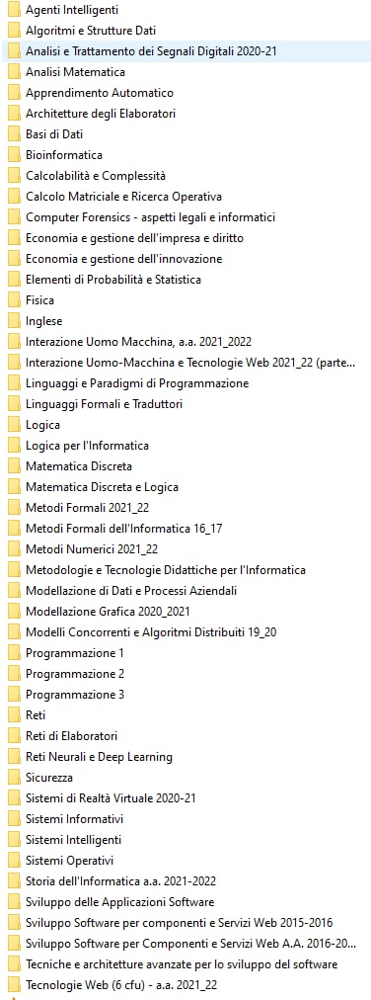

# Lista Videolezioni Moodle

Questa lista rappresenta un punto di aggregazione delle videolezioni passate **per ogni materia**.

Ad ogni materia viene associato un magnet, che potrete usare (semplicemente cliccandoci sopra) per scaricare il materiale _completo_ della materia.
I materiali sono in formato zip, vi chiediamo gentilmente di seedare per quanto possibile e tenere tutti i torrent vivi!

**NB PER I TORRENT**: NECESSARIO AGGIUNGERE TUTTI I _TRACKERS_ PRESENTI A [QUESTO](https://raw.githubusercontent.com/ngosang/trackerslist/master/trackers_all.txt) LINK QUANDO NON CI SONO NEL MAGNET!

## Triennale & Magistrale (misti)

- Tutti i files della triennale e qualcosa della triennale, in un unico zip: [clicca qui](files/moodle.zip.torrent)

